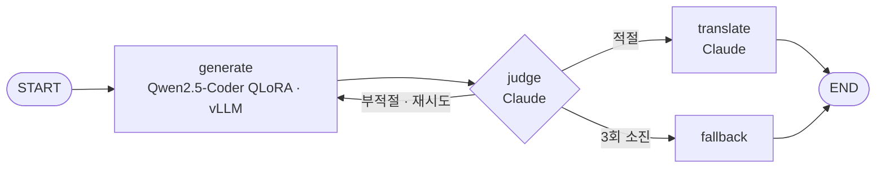
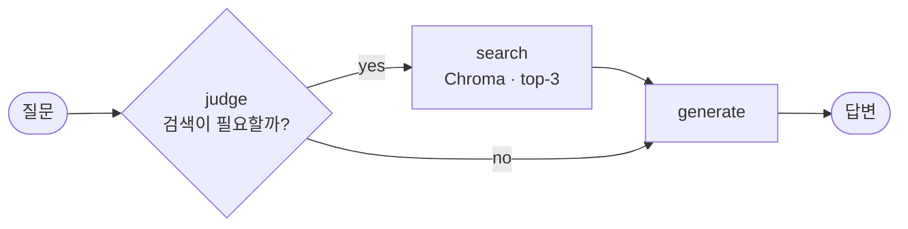

 

> **프레임워크를 쓰기 전에, 그 프레임워크가 무엇을 대체하는지 먼저 이해한다.**
> 같은 기능을 손으로 한 번, 프레임워크로 한 번 더 만들어 보면서 배웁니다.

 

## 👋 About Me

- 🎓 **카카오테크 부트캠프 4기 AI 과정** — 5월부터 배운 걸 매일 TIL로 남겨 **42편**, 구름 EXP 랭커까지 올라갔어요
- 🧪 RAG를 라이브러리 몇 줄로 끝내지 않고 **순수 Python → LangChain → LangGraph** 순서로 세 번 다시 만들었어요
- 🔧 모델을 API로 빌려 쓰는 데서 멈추지 않고, 오픈 모델을 **QLoRA로 직접 학습해 vLLM으로 서빙**해 봤어요
- 🐛 에러 메시지가 진짜 원인을 말해주지 않을 때, `print`로 중간값을 찍어 가며 끝까지 좁혀 가는 편이에요

 

## 🛠 Tech Stack

<table>
  <tr>
    <td align="center" width="130"><b>LLM · Agent</b></td>
    <td>
      
      
      
      
    </td>
  </tr>
  <tr>
    <td align="center"><b>Model</b></td>
    <td>
      
      
      
      
      
      
    </td>
  </tr>
  <tr>
    <td align="center"><b>Backend</b></td>
    <td>
      
      
      
    </td>
  </tr>
  <tr>
    <td align="center"><b>Infra</b></td>
    <td>
      
      
      
      
    </td>
  </tr>
</table>

 

## 🚀 Featured Projects

### 📚 [TIL-RAG](https://github.com/KIMDONGWOOK12/til-rag)

**내 TIL로 답하는 RAG를 세 번 다시 만들고, 코드 리뷰 모델까지 직접 학습시킨 프로젝트**

`순수 Python` → `LangChain (LCEL)` → `LangGraph Workflow` → `LangGraph ReAct Agent`

| 🔁 **3번** | 📦 **6,529개** | 🧬 **7번** | ⚖️ **2개** |
|:---:|:---:|:---:|:---:|
| 같은 RAG를 다시 구현 | GitHub PR 리뷰 학습 데이터 | QLoRA 학습 반복 (v1 → v7) | LLM 심판 (Gemini + Claude) |

- **TIL 질의응답** — ReAct Agent가 검색이 필요하다고 판단할 때만 `search_til` 도구를 호출해요
- **코드 리뷰 확장** — 15개 Python 오픈소스의 merge된 PR 리뷰를 모아 `Qwen2.5-Coder-7B`를 QLoRA로 파인튜닝하고, Colab A100에서 vLLM으로 서빙했어요
- **자체 모델 검증 루프** — 작은 모델은 혼자 믿기 어려워서, Claude가 답을 판정·번역하고 3번 실패하면 솔직하게 실패를 알려요
- **배포** — Docker → Docker Hub → AWS EC2, GitHub Actions로 push하면 자동 배포돼요

<b>🧬 학습 이력 v1 → v7 펼쳐보기</b>

 

| 버전 | 데이터 | 베이스 모델 | steps | 결과 |
|:---:|---:|---|---:|---|
| v1 | 286 | Qwen2.5-1.5B-Instruct | 60 | 과적합 — 무관한 질문에도 학습 문장을 재생 |
| v2 | 286 | Qwen2.5-1.5B-Instruct | 25 | 학습 부족 — 지시를 못 따르고 코드를 생성 |
| v3 | 1,334 | Qwen2.5-1.5B-Instruct | 100 | 균형 — SQL 인젝션 첫 정확 답변 |
| v4 | 6,529 | Qwen2.5-7B-Instruct | 500 | 불안정 — 답변 편차가 큼 |
| v5 | 6,529 | Qwen2.5-7B-Instruct | 800 | 안정적이지만 SQL에 약함 |
| v6 | 6,529 | Qwen2.5-Coder-7B-Instruct | 800 | SQL은 완벽, 대신 과적합 |
| **v7** | 6,529 | **Qwen2.5-Coder-7B-Instruct** | **350** | **균형 잡힌 최종 채택본** |

**두 번의 전환점**
1. **데이터 양이 정확도를 결정했다** — 286개 → 1,334개로 늘리자 엉뚱하던 답이 정확해졌어요
2. **베이스 모델의 사전 지식이 결정적이었다** — 범용 모델은 6,529개로도 SQL 인젝션을 못 잡았지만, Coder 모델로 바꾸자 바로 잡았어요. 대신 과적합이 쉬워서 steps를 800 → 350으로 줄였어요

      

 

### 🤖 [Dev Docs RAG Agent](https://github.com/KIMDONGWOOK12/dev-docs-rag-agent)

**질문을 보고 "검색이 필요한지"부터 스스로 판단하는 LangGraph RAG 에이전트**

- **데이터** — TIL 42편 → 387개 청크 → `gemini-embedding-001` → Chroma에 영속 저장 (재실행 시 재인덱싱 없음)
- **조건부 분기** — "LCEL이 뭐야?"는 TIL을 검색해서, "안녕하세요"는 검색 없이 바로 답해요
- **프로바이더 전환** — `.env`의 `LLM_PROVIDER` 하나로 **Gemini ↔ Claude ↔ Ollama**, 모든 LLM 호출은 지수 백오프로 최대 3회 재시도
- **평가** — LangSmith Dataset으로 **키워드 매칭 vs LLM-as-Judge** 비교. "State/Node/Edge"와 "노드/엣지"처럼 표현만 다른 답을 키워드 매칭은 0점, LLM 심판은 정답으로 처리하는 걸 확인했어요
- **서빙** — FastAPI `POST /query`, lifespan에서 그래프를 앱 시작 시 한 번만 빌드

     

 

## 🔍 삽질하며 배운 것

| 문제 | 원인 | 해결 |
|---|---|---|
| `.env`는 맞는데 LLM이 계속 Gemini로 뜸 | `load_dotenv()`보다 `nodes.py` import가 먼저 실행돼 기본값으로 굳음 | 어디서 import되든 모듈이 스스로 환경변수를 읽도록 `nodes.py`에서 `load_dotenv()` |
| 임베딩 중 429 에러 | 배치 90개 · 대기 15초로 분당 100건 한도 초과 | 배치 50개 · 대기 45초로 조정 |
| 범용 7B 모델이 SQL 인젝션을 못 잡음 | 데이터를 늘려도 보안 패턴에 대한 사전 지식이 부족 | `Qwen2.5-Coder`로 교체하고 steps를 800 → 350으로 줄여 과적합 완화 |
| 코드 리뷰 검색 결과를 어디서 자를지 | 관련 질문은 거리 0.15–0.26, 무관한 질문은 0.34–0.40으로 갈림 | 그 사이인 **0.30**을 threshold로 설정 |
| 같은 코드에 자체 모델 답이 매번 다름 | temperature를 낮춰도 그대로 — 모델 자체의 한계 | Claude judge / fallback으로 **외부 검증 레이어** 추가 |

 

## 🌱 Also Working On

- 🛰 [**Orbit-ChatBot**](https://github.com/KIMDONGWOOK12/Orbit-ChatBot) — 개발 문서 RAG 챗봇. 직접 학습시킨 **miniGPT (33.6M)** 를 생성 모델로 붙이는 게 목표예요
- 🪐 [**Orbit**](https://github.com/KIMDONGWOOK12/Orbit) — SNS 시스템 만들기

<!--
## 📫 Contact
연락처를 공개하고 싶다면 이 주석을 풀고 주소를 채워 넣으세요.

-->

 

